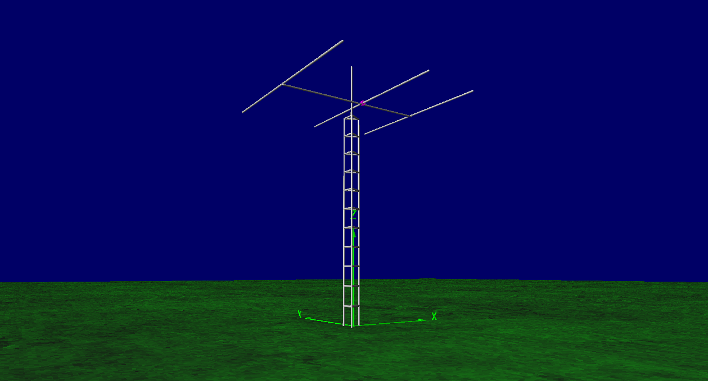
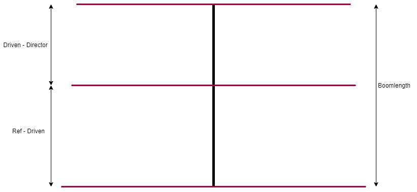

# 10/15m Band Portable Yagi Antenna
Dualband portable 2 elements yagi antenna  for 10m and 15m CW.
The idea behind it is simple; We construct a 2-elements Yagi antenna for 15m band, then add 10m band 2 elements yagi into it so the driven element for the 10m band is open-sleeve-coupled from the 15m band driven element. This method of feeding will results of an easy-to-construct-and-feed dualband yagi antenna at the expense of narrower bandwidth at the higher band.
The narrower bandwidth is not a problem since the usage at 10m band is intended for CW portion only.

## Dimensions
The picture below will tell thousands words. Please left click / right click + open in new tab for the full view of the picture.

**Tuning procedure:**
* Mount the antenna at the real installation height, or at least 7 m above the ground.
* Tune the 15 m band driven element for the lowest VSWR at 21.05 MHz. Adjust both end simultaneously.
* Tune the 10 m band driven element for the lowest VSWR at 28.05 MHz. Adjust both end simultaneously.
* Back to 15 m band and check if whether the VSWR shift after 10 m band tuning. If so, then re-adjust the 15 m band driven element.
* Again, back to 10 m band and check again. Repeat this procedure until VSWR is satifying at both band.

**Typical VSWR:**
* 15m band; 1.04:1 at 21.05 MHz
* 10m band; 1.12:1 at 28.05 MHz

**Typical gain:**
* 15m band (10 m above ground); 11.5 dBi
* 10m band (10 m above ground); 12.4 dBi

## Simulation Results (15m Band)

## Simulation Results (10m Band)

## Propagation Map Simulation (VOACAP Online, May 2019)
**15m band at 9 UTC**

**10m band at 11 UTC**

## Contributing
1. Fork it [https://github.com/handiko/3E-40M-YAGI/fork](https://github.com/handiko/3E-40M-YAGI/fork)
2. Create new branch (`git checkout -b myfeature`)
3. Do some editing / create new feature
4. Commit your works (`git commit -m "Adding some myfeature blah blah.."`)
5. Push to the branch (`git push -u origin myfeature`)
6. Create a new Pull Request
