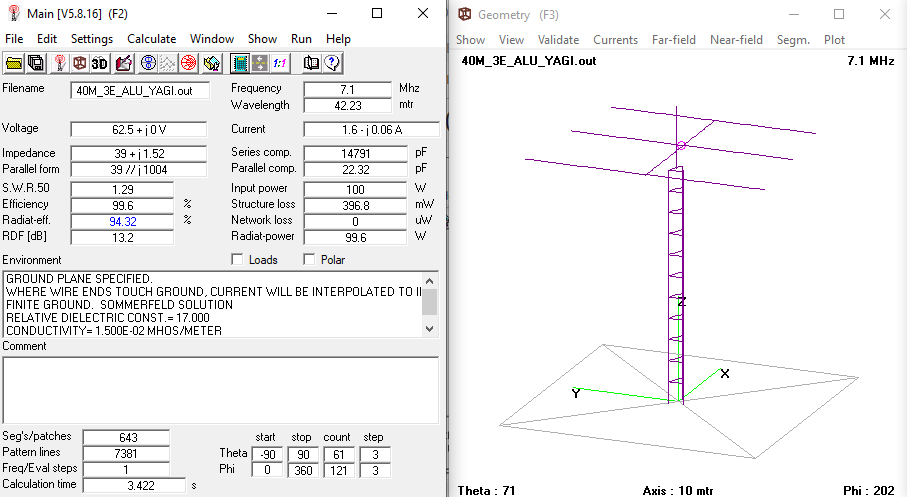
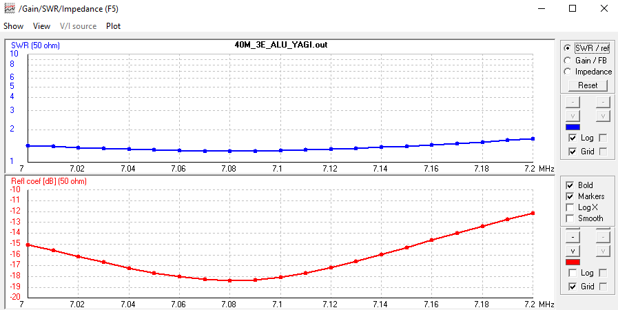
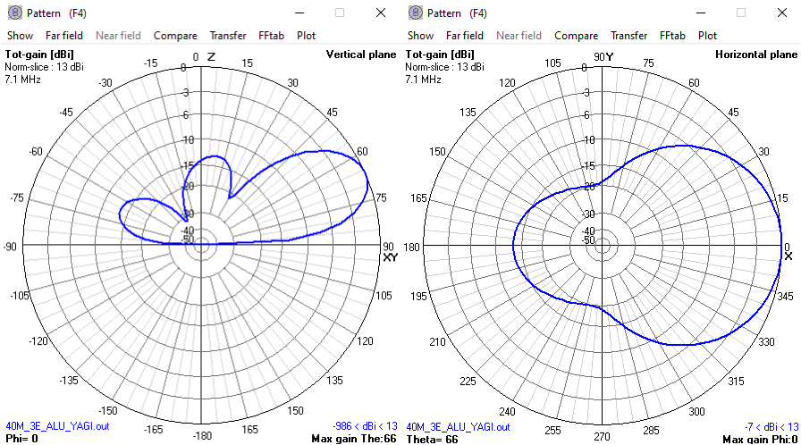
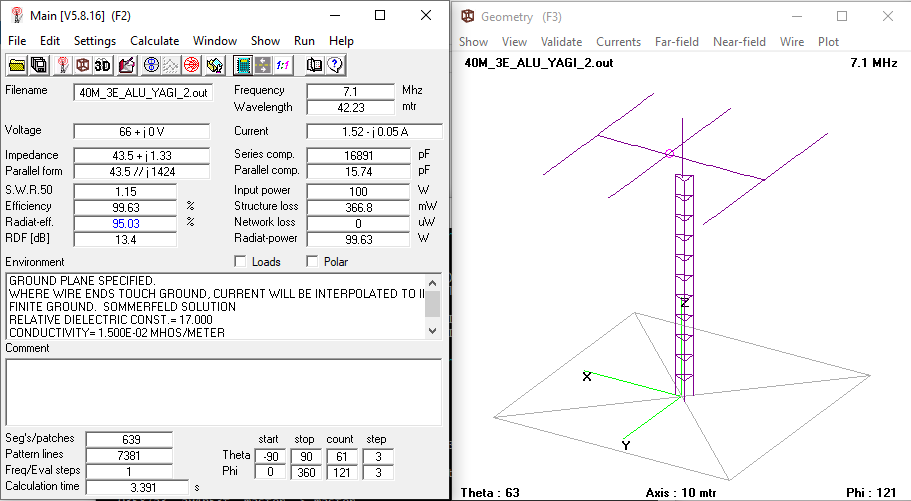
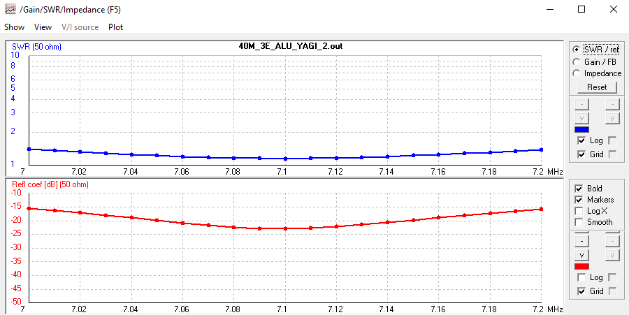
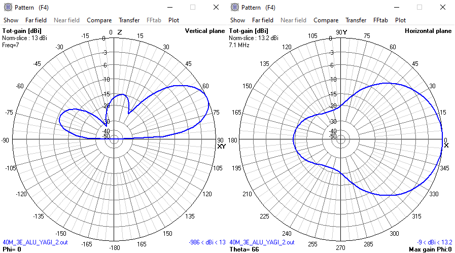
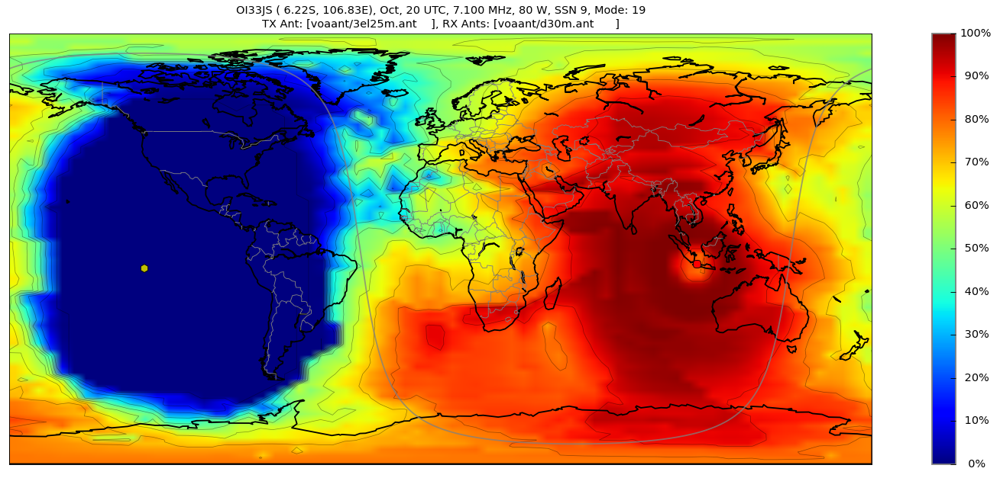

# 3 Elements Fullsize Yagi Antenna for 40m Band
Here is presented 2 models of 3 elements fullsize yagi antenna for 40m band.
The **first model** is optimized for the **boomlength of 16 meters** while keep maintain good **VSWR < 1:1.5**, gain, and F/B ratio. The second model is optimized for **lowest VSWR while keep maintain the boom length below 17 meters** otherwise. All models are simulated for the installation height of about 24 meters using 4nec-2 software package.

## Dimensions
The picture below will tell thousands words. Please left click / right click + open in new tab for the full view of the picture.

**Tuning procedure:**
* Mount the antenna at the real installation height.
* **USE A GOOD 1:1 BALUN or CHOKE BALUN** at the feed point.
* Do the tuning procedure using Antenna Analyzer or SWR Analyzer using 50 Ohm Coax as short & practical as possible. Here, you want to eliminates tuning error caused by the long coax. Therefore, use a short coax.
* Tune the antenna for the lowest VSWR at the center freq of the 40m band, or at any 40m band freq you want. Adjust both end simultaneously.

**Typical VSWR:**
(derived from simulation)

|**Parameters**          |**Model 1**|**Model 2**|
|:----------------------:|:---------:|:---------:|
|**@7.0 MHz**            | 1:1.4     | 1:1.4     |
|**@7.1 MHz**            | 1:1.3     | 1:1.15    |
|**@7.2 MHz**            | 1:1.6     | 1:1.38    |
|**VSWR Bandwidth 1:1.5**| 190 kHz   | 250 kHz   |

**Typical Gain and F/B**
* **Model 1**: 13.0 dBi of forward gain & about 14 dB of F/B
* **Model 2**: 13.2 dBi of forward gain & about 15 dB of F/B 

## Simulation Results (Model 1)

## Simulation Results (Model 2)

## Propagation Map Simulation (VOACAP Online, Oct 2019 at 20 UTC, 80 W of transmit power)
(both models are virtually the same)

## Contributing
1. Fork it [https://github.com/handiko/3E-40M-YAGI/fork](https://github.com/handiko/3E-40M-YAGI/fork)
2. Create new branch (`git checkout -b myfeature`)
3. Do some editing / create new feature
4. Commit your works (`git commit -m "Adding some myfeature blah blah.."`)
5. Push to the branch (`git push -u origin myfeature`)
6. Create a new Pull Request
